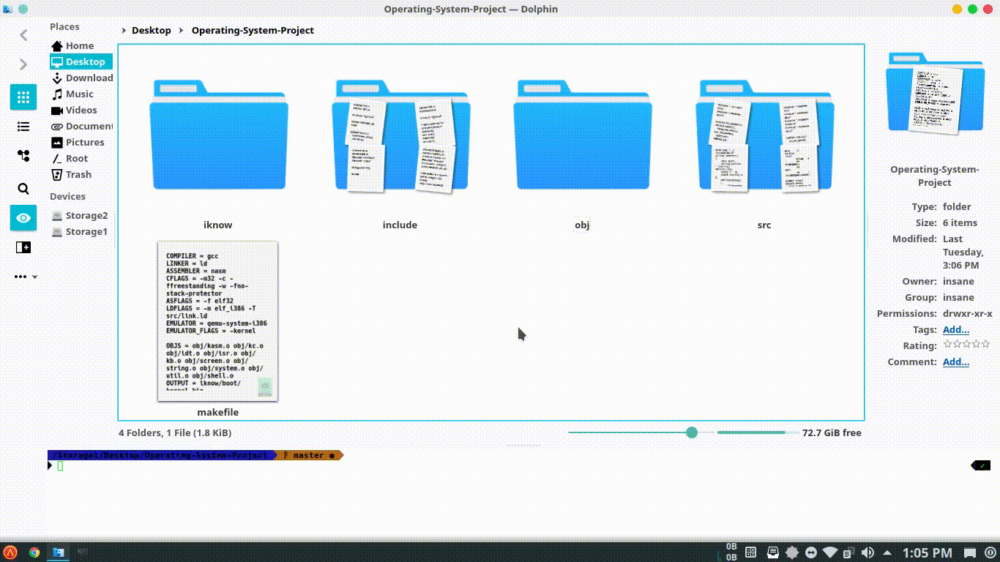

# Operating-System-Project

A repository based on the Operating System labworks

## Introduction

An operating system (OS) is system software that manages computer hardware, software resources, and provides common services for computer program. An operating system (OS) is system software that manages computer hardware, software resources, and provides common services for computer programs.

## Getting started

Start from here: https://github.com/Prapti-044/Operating-System-Project

Install pre-requisite dependencies

### Pre-requisites

Oracle VM Virtual Box

## Author

Shadmaan Hye Prapti

praptishadmaan@gmail.com

Student at Department of Computer Science and Engineering
